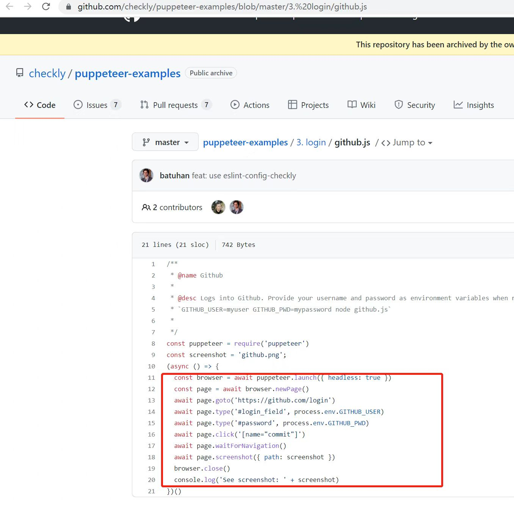
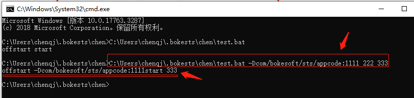

# questions
问题


```
vue.esm.js?a026:591 [Vue warn]: $attrs is readonly.
vue.esm.js?a026:591 [Vue warn]: $listeners is readonly.
---> <ElInput> at packages/input/src/input.vue
       <Root>
```

就是报这样的错误

原因：vue和elementUI的版本不匹配

解决办法：升级vue和elementUI的版本就好了


# 查询端口命令：

```
netstat -ano|findstr 48000
```

# 杀死进程命令：

```
taskKill /T /F /PID 17264
```


自动化脚本相关



# bat 文件中%0、%1等是表示什么

x:目录下有test.bat, 内容如下：

```
@echo offstart %1start %3
```

直接cmd窗口执行如下命令：

```
 x>.\test.bat -Dcom.bokesoft.sts.appcode=1111 222 333
 
%1: -Dcom.bokesoft.sts.appcode=1111
%2: 222
%3: 333
```

执行结果输出如下：

```
offstart -Dcom/bokesoft/sts/appcode:1111start 333
```

因命令行里只有%1 & %3，没有%2故而没有输出222
